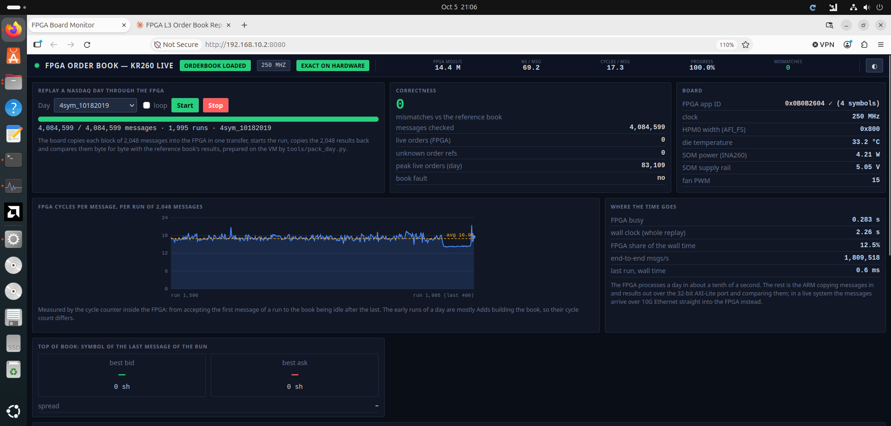

# Multi-Symbol Level-3 Order Book Accelerator on FPGA

**Hardware NASDAQ ITCH book building for 4 stocks on the AMD Kria KR260 (Zynq UltraScale+ MPSoC)**

**View the report:** `https://<your-user>.github.io/<this-repo>/`

- Designed and timing-closed a full-depth (Level-3) order book in SystemVerilog. It tracks every live order of 4 stocks (AAPL, MSFT, NVDA, TSLA) from the NASDAQ ITCH feed and outputs each stock's best bid and ask after every message. All stocks share one 196,608-order store in 52 UltraRAMs using two-choice hashing. Each stock has its own bid and ask price ladders with a 3-level bitmap that finds the next price level in 5 cycles, and the best 4 levels per side stay in registers. Critical paths are pipelined to meet 250 MHz on the K26 with 0 failing endpoints, and an Add reaches the top of book in 24 ns.
- Verified against a Python reference book in cocotb and QuestaSim, then ran on the KR260: a full real NASDAQ trading day (2019-10-18, 4,084,599 messages from 4 stocks, interleaved by time) with **0 mismatches** at **14.4 M messages/s** (69 ns average). The simulation's cycle counts matched the board's measurement (17.29 vs 17.3 cycles per message). A live web dashboard served by the board's ARM cores shows each run.

The report (`index.html`) contains two interactive animations (the data flow end to end, and a cycle-by-cycle timing breakdown per operation), the Vivado block design, simulation waveforms, synthesis and implementation results, timing, floorplan, power, and recordings of the board run.

This repository holds the report only.
